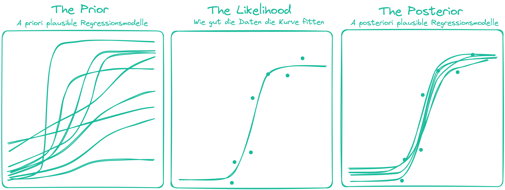

# Grundlegende Begriffe

## Wahrscheinlichkeitsbegriff von Laplace
Die mathematische Wahrscheinlichkeitstheorie (Stochastik) ist ein vergleichsweise junge Subdisziplin, die erst zu Beginn des 20. Jahrhunderts axiomatisch formalisiert wurde. in diesen Ansätzen definiert man *Wahrscheinlichkeitsmaße* z.B. durch die folgenden Axiome.  
Das ist weder besonders intuitiv noch hilfreich für die Anwendung in der Datenanalyse. Eine wichtige Kontextinfromation könnte jedoch sein, dass die Wahrscheinlichkeits*rechnung* bis ins 19. Jhd. hinein vor allem als Hilfsmittel für Glücksspiele und Wetten entwickelt wurde. In diesem Kontext ist es recht hilfreich und intuitiv Wahrscheinlichkeit als relative Häufigkeit zu verstehen. So findet man auch etwa in Mathematikbüchern der 7.ten Klasse Aussagen wie 

> "Die Wahrscheinlichkeit, dass eine gerade Zahl gewürfelt wird, beträgt 3/6, denn es gibt 6 mögliche Ergebnisse und drei günstige."

## Stochastik vs. Statistik
Infolge dessen waren dann viele Mathematiker:innen daran interessiert bei welchen Spielen mit welche Strategien mit welcher Wahrscheinlichkeit welcher Erfolg eintritt. Also zum Beispiel beim Roulette: Ich starte mit 10.000€ und setze immer 100€ + die Gewinne aus den Vorrunden auf Rot. Wie wahrscheinlich ist es, dass ich in 100 Runden 20.000€ habe? Wie wahrscheinlich ist es, dass ich nach 100 Runden pleite bin?
Die Berechnung der Wahrscheinlichkeit solcher real einretender Szenarien (= Daten) kann man anstellen, **weil man die Wahrscheinlichekit der Elementarereignisse (Rot, Schwarz, Grün) kennt**. Das ist das kerninteresse der Stochastik.

Die Statistik hingegen interessiert sich für die umgekehrte Frage: **Wenn ich die Beobachtungen (Daten) habe, was kann ich dann über die Wahrscheinlichkeiten der Elementarereignisse sagen?**

## Bayesianischer Wahrscheinlichkeitsbegriff
Wenn es sich bei den Elementarereignissen nicht um Glücksspiele handelt, kann die relative Häufigkeit etwas kontraintuitiv sein: Wenn die Wahrscheinlichkeit einer Befragung ergibt, dass Donald J. Trump 🍊 mit 54% Wahrscheinlichkeit eine neue Amtszeit bekommt, dann ist die Interpretation, dass er in 54 von 100 Fällen gewinnt nicht besonders hilfreich. Vielmehr ist die Wahrscheinlichkeit dann eine Aussage über die Unsicherheit, die wir haben, wenn wir aufgrund der Daten Schlussfolgerungen über den die Daten generierenden Mechanismus treffen wollen. Die 54% würden dann also als *»ziemlich genau in der Mitte von **unmöglich** und **sicher«*** interpretiert werden.

## Bayes Theorem
Bayes Theorem ist ein stochastischer Satz der eine bedingte Wahrscheinlichkeit $P(A|B)$ zur bedingten Wahrscheinlichkeit $P(B|A)$ in die andere Richtung umrechnet.  
 $P(A|B)$ ist dabei schulmathematisch als *»Die Wahrscheinlichkeit dass A eintritt unter der Annahme, dass B bereits eingetreten ist«* zu verstehen.
 
> Beispiel: Es liegen in einer Urne 2 blaue und vier grüne Kugeln, ich ziehe zwei Kugeln ohne zurücklegen.  
Ist das Ereignis $A$ = *»Blaue Kugel im ersten Zug«*, $B$ = *»grüne Kugel im ersten Zug«* und $C$ = *»grüne Kugel im zweiten Zug«* dann ist $P(C|A) = 4/5$ und $P(C|B) = 3/5$ 
 
### Dynamische Veranschaulichung
Die beste dynamische Visualisierung zur Erklärung des Bayes Theorems, die ich kenne, ist die folgende:

Gefragt wird ja zu Beginn nach $P(\text{librarian}|\text{meek\;and\;tidy\;soul})$ welche unter Verwendung der Wahrscheinlichkeit $P(\text{meek\;and\;tidy\;soul}|\text{librarian})$ berechnet wird.  
Verallgemeinert kann man sagen dass Bayes Theorem die Wahrscheinlichkeit $P(\text{Hypothesis}|\text{Data})$ unter Verwendung der Wahrscheinlichkeit $P(\text{Data}|\text{Hypothesis})$ mit folgender Formel berechnet:

$$
\overbracket[0.25pt]{P (\text{Hypothesis} \mid \text{Data})}^{\text{Posterior}} = \frac
{{\overbracket[0.25pt]{P (\text{Hypothesis})}^{\text{Prior}}} \times
{\overbracket[0.25pt]{P (\text{Data} \mid \text{Hypothesis})}^{\text{Likelihood}}}}
{{\underbracket[0.25pt]{{P(\text{Data})}}_{\text{Average likelihood}}}}
$$

Im YouTube-Beispiel haben wir gesehen wie Bayes Theorem auf ein Modell angewendet wird, das wir uns als Urne mit Kugeln zweier Farben vorstellen können, wobei eine Farbe Farmer und eien Farbe Librarians enkodiert.  
In der Regressionsmodellierung wird Bayes Theorem benutzt um die Parameter eines Regressionsmodells zu spezifizieren. Nehmen wir an wir wollen modellieren mit welcher Vorbereitungszeit welcher Erfolg in einer Klausur einhergeht, könnten Prior (Predictions), Data & Likelihood sowie Posterior (Predictions) wie folgt aussehen:

{}
Bevor wir uns aber anschauen wie wir zu diesen Posterior-Verteilungen kommen, schauen wir uns nochmal die grundlegende Unterscheidung Inferenz- und Deskriptivstatistik sowie zwischen Schätzung und Testung an.